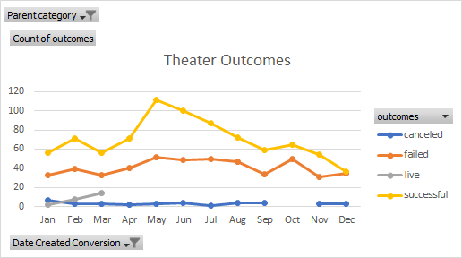

# An Analysis of Kickstarter Campaigns
## Analysis of kickstarter campaign trends 
The kickstarter data set contained valuable information on many differnet campaign categories, such as campaigns for theatrical works. The data showed that roughly 62% of all US play campaigns succeded, with a campaigns lauching between late fall and early summer having the most success.

