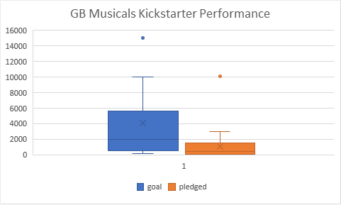

# An Analysis of Kickstarter Campaigns
## Analysis of kickstarter campaign trends 
The kickstarter data set contained valuable information on many differnet campaign categories, such as campaigns for theatrical works. The data showed that roughly 62% of all US play campaigns succeded, with a campaigns lauching between late fall and early summer having the most chance for success.

I would advise Lousie to launch a campaign for the play around May and to aim for a budget of around $5,000 as the average goal for successful US plays was $5,049. In regards to a campaign for a British musical, the data would suggest a campaign goal of £4,000 too ambitious as the average pledge came in at just under £1050. A campaign with a target goal of £2,000 should have an increased chance of sucess.

